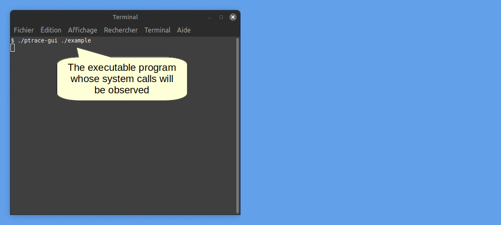

## Intro

`ptrace-gui` a downsized alternative to `strace` with a GUI.
It is designed as a teaching tool for my introductory course on linux system programming.

It's main feature is the step by step mode : execution pauses at each system call and the user must click on continue to resume.

This is a work in progress. It's heavily based on [lurk](https://github.com/JakWai01/lurk) and the [iced GUI library](https://github.com/iced-rs/iced) version 0.13.1.

## Example

Here is an example of ptrace-gui showing the system calls of this program [example.c](demo/example.c).



## Build

```
$ cargo build --release
```

## Usage

```
$ ptrace-gui ./yourprogram
```

## License

ptrace-gui is a derivative work of [lurk](https://github.com/JakWai01/lurk).

ptrace-gui (c) 2025 Maxime Bourreau

lurk (c) 2022-2023 Jakob Waibel, Yuri Astrakhan, and contributors

SPDX-License-Identifier: MIT OR Apache-2.0

