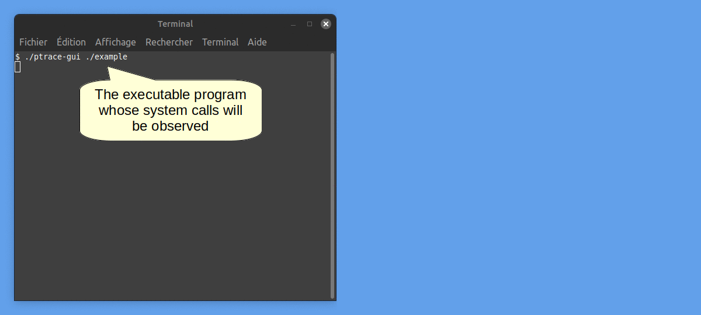

## Intro

`ptrace-gui` a downsized alternative to `strace` with a GUI.
It is designed as a teaching tool for my introductory course on linux system programming.

Its main feature is the step-by-step mode : execution pauses at each system call, and the user must resume the execution manually.

Please note that the pedagogical rules (such as when to pause, or how to format and present execution events) are still being explored and are currently spread across different parts of the codebase.

This project is based on [lurk](https://github.com/JakWai01/lurk) and the [iced GUI library](https://github.com/iced-rs/iced) version 0.14.0.

## Example

Here is an example of `ptrace-gui` displaying the system calls of [a C program](demo/example.c).



## Build

```
$ cargo build --release
```

## Usage

```
$ ptrace-gui ./yourprogram
```

## License

ptrace-gui is a derivative work of [lurk](https://github.com/JakWai01/lurk).

ptrace-gui (c) 2025 Maxime Bourreau

lurk (c) 2022-2023 Jakob Waibel, Yuri Astrakhan, and contributors

SPDX-License-Identifier: MIT OR Apache-2.0
